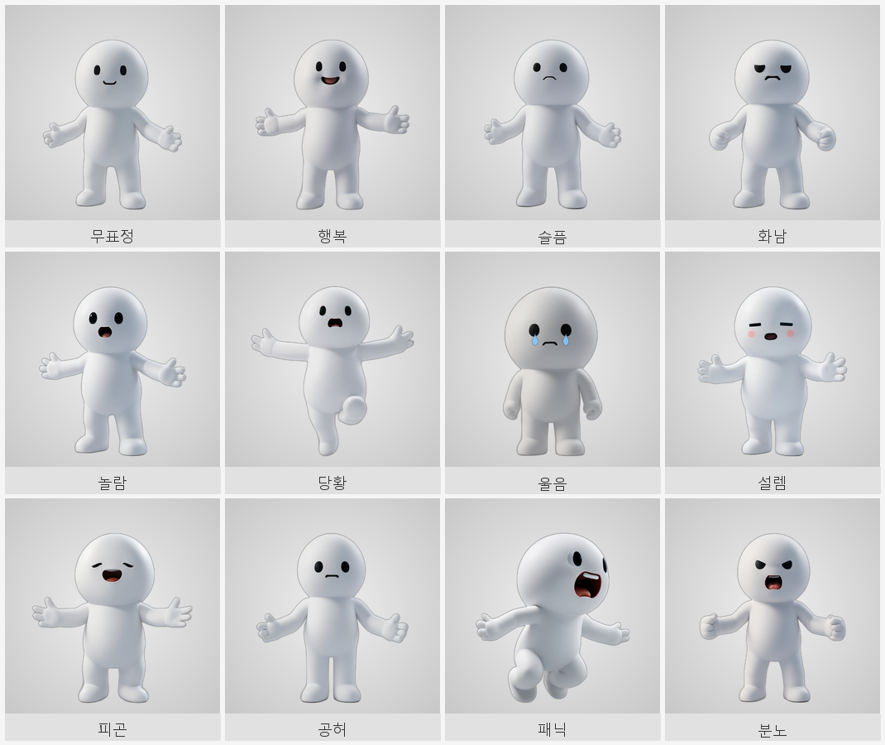
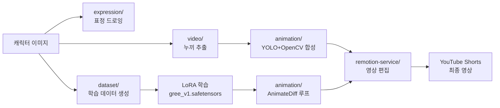

   

# gree — 그리 YouTube Shorts 파이프라인

그리 캐릭터 기반 YouTube Shorts 자동 생성 파이프라인.  
표정 드로잉 · 학습 데이터 생성 · YOLO + OpenCV 영상 합성 · Remotion 편집 · ComfyUI AnimateDiff 애니메이션.

---

## 그리 — 3D 표정 12종

<div align="center">



</div>

| 행 | 표정 |
|----|------|
| 1행 | 무표정 · 행복 · 슬픔 · 화남 |
| 2행 | 놀람 · 당황 · 울음 · 설렘 |
| 3행 | 피곤 · 공허 · 패닉 · 분노 |

> dreamshaper_8 + jeonggwichan_v6 LoRA · ComfyUI 생성 · 512×512

---

## 파이프라인 흐름



---

## 모듈 설명

| 모듈 | 파일 | 설명 |
|------|------|------|
| **expression** | `draw_emotions.py` | Pillow 기반 6종 표정 직접 드로잉 (픽셀 좌표, 4× AA) |
| **expression** | `gen_expression_dataset.py` | 13종 표정 학습 데이터셋 + 캡션 자동 생성 |
| **animation** | `cv_effects.py` | YOLOv8 탐지 + OpenCV 배경/화면/캐릭터 합성 |
| **animation** | `gen_animate.py` | ComfyUI AnimateDiff-Evolved 16프레임 루프 생성 |
| **dataset** | `gen_dataset_v2.py` | ControlNet 입력용 15장 학습 데이터 생성 |
| **dataset** | `gen_pose_dataset.py` | 123포즈 × 3 seed = 369장 포즈 데이터셋 생성 |
| **video** | `make_char_video.py` | rembg 누끼 제거 → MP4 / WebM 변환 |
| **remotion-service** | `remotion-service/` | Remotion 4.0 기반 React 영상 편집 서비스 |

---

## 빠른 시작

```bash
# 1. Python 의존성 설치
pip install -r requirements.txt

# 2. 표정 드로잉 (char_clean.png 필요)
python src/expression/draw_emotions.py

# 3. 표정 데이터셋 생성 (1.png 필요)
python src/expression/gen_expression_dataset.py

# 4. 포즈 데이터셋 생성
python src/dataset/gen_pose_dataset.py

# 5. ControlNet 학습 데이터 생성
python src/dataset/gen_dataset_v2.py

# 6. AnimateDiff 루프 애니메이션 생성 (ComfyUI 서버 필요)
python src/animation/gen_animate.py

# 7. YOLO + OpenCV 영상 합성
python src/animation/cv_effects.py --mode yolo_composite \
  --input video.mp4 --char char_clean.png --model yolov8n.pt --out out.mp4

# 8. 캐릭터 누끼 → 영상 변환
python src/video/make_char_video.py --input char.webp --out char.mp4

# 9. Remotion 영상 편집 서비스 실행
cd remotion-service && npm install && npm run dev
```

---

## 폴더 구조

```
gree/
├── src/
│   ├── expression/
│   │   ├── draw_emotions.py          # 6종 표정 Pillow 드로잉
│   │   └── gen_expression_dataset.py # 13종 표정 데이터셋 + 캡션
│   ├── animation/
│   │   ├── cv_effects.py             # YOLOv8 + OpenCV 배경/화면/캐릭터 합성
│   │   └── gen_animate.py            # ComfyUI AnimateDiff 16프레임 루프
│   ├── dataset/
│   │   ├── gen_dataset_v2.py         # ControlNet 15장 학습 데이터
│   │   └── gen_pose_dataset.py       # 123포즈 × 3seed 369장
│   └── video/
│       └── make_char_video.py        # rembg 누끼 → MP4/WebM
├── remotion-service/                 # Remotion 4.0 영상 편집 서비스
├── SPEC.md
├── README.md
└── requirements.txt
```

---

## 관련 레포

- [rhlfur2055-prog/animation](https://github.com/rhlfur2055-prog/animation) — 그리 캐릭터 원본 + 표정 드로잉 v2 / 데이터셋 생성 v2
