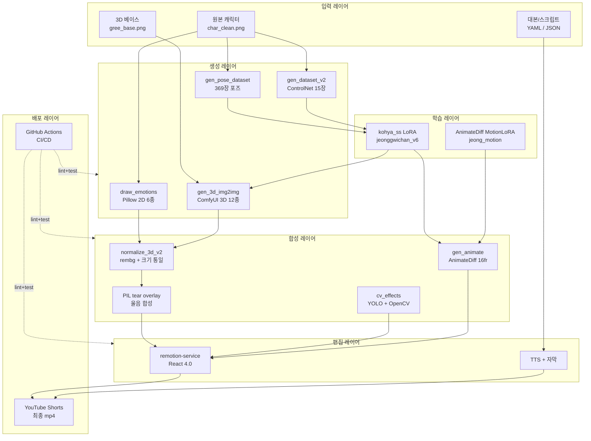
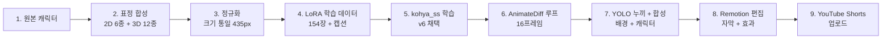
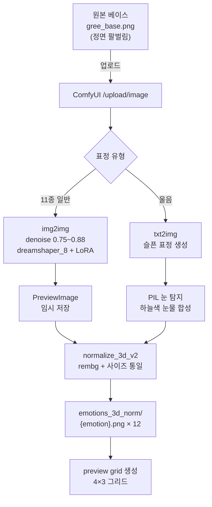
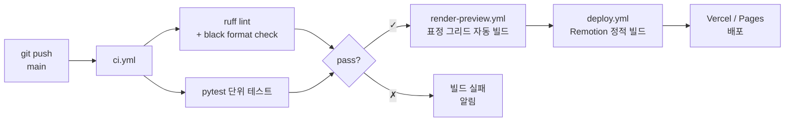

     

# gree — 그리 YouTube Shorts 파이프라인

오리지널 캐릭터 **그리(gree)** 기반 YouTube Shorts 자동 생성 엔드투엔드 파이프라인.
표정 합성 · LoRA 학습 · 3D 렌더 표정 · YOLO+OpenCV 영상 합성 · AnimateDiff 애니메이션 · Remotion 영상 편집 · 자동 배포.

---

## 그리 — 3D 표정 12종

<div align="center">


</div>

| 행 | 표정 |
|----|------|
| 1행 | 무표정 · 행복 · 슬픔 · 화남 |
| 2행 | 놀람 · 당황 · 울음 · 설렘 |
| 3행 | 피곤 · 공허 · 패닉 · 분노 |

> dreamshaper_8 + jeonggwichan_v6 LoRA · ComfyUI img2img · PIL 합성 · 512×512 · 캐릭터 높이 435px 통일

---

## 시스템 아키텍처



---

## 엔드투엔드 파이프라인



---

## 모듈 설명

| 카테고리 | 파일 | 설명 |
|---------|------|------|
| **2D 표정** | `src/expression/draw_emotions.py` | Pillow 기반 6종 표정 직접 드로잉 (픽셀 좌표, 4× AA) |
| **2D 표정** | `src/expression/gen_expression_dataset.py` | 13종 표정 학습 데이터셋 + 캡션 자동 생성 |
| **3D 표정** | `gen_3d_img2img.py` | ComfyUI img2img + LoRA 12종 생성 (denoise 0.75~0.88) |
| **3D 표정** | `normalize_3d_v2.py` | rembg 알파 bbox 기반 캐릭터 높이 435px 통일 |
| **3D 표정** | `cry_tear_overlay.py` | PIL 하늘색 눈물방울 합성 (눈 자동 탐지) |
| **데이터셋** | `src/dataset/gen_dataset_v2.py` | ControlNet 입력용 15장 학습 데이터 생성 |
| **데이터셋** | `src/dataset/gen_pose_dataset.py` | 123포즈 × 3 seed = 369장 포즈 데이터셋 |
| **애니메이션** | `src/animation/cv_effects.py` | YOLOv8 탐지 + OpenCV 배경/화면/캐릭터 합성 |
| **애니메이션** | `src/animation/gen_animate.py` | ComfyUI AnimateDiff-Evolved 16프레임 루프 |
| **비디오** | `src/video/make_char_video.py` | rembg 누끼 제거 → MP4 / WebM 변환 |
| **편집** | `remotion-service/` | Remotion 4.0 기반 React 영상 편집 서비스 |
| **CI/CD** | `.github/workflows/` | lint · test · build · publish 자동화 |

---

## 3D 표정 생성 파이프라인



**핵심 로직:**
1. **베이스 일관성**: 모든 표정은 동일한 `jeong_train_01_3d_front_base.png` 기반 img2img로 캐릭터 형태 유지
2. **표정 다양성**: denoise 값으로 변화 강도 조절 (0.75 = 약함, 0.88 = 강함)
3. **눈물 합성**: rembg로 캐릭터 알파 마스크 추출 → numpy로 검정 픽셀 bbox 탐지 → PIL로 하늘색 눈물방울 드로잉
4. **크기 정규화**: 모든 캐릭터 높이를 435px(캔버스 85%)로 강제 통일 → 그리드에서 시각적 통일감

---

## 폴더 구조

```
gree/
├── .github/
│   └── workflows/
│       ├── ci.yml                       # 린트 + 테스트
│       ├── render-preview.yml           # 표정 그리드 자동 생성
│       └── deploy.yml                   # Remotion 빌드 + 배포
├── src/
│   ├── expression/
│   │   ├── draw_emotions.py             # 2D 6종 Pillow 드로잉
│   │   └── gen_expression_dataset.py    # 13종 데이터셋 + 캡션
│   ├── animation/
│   │   ├── cv_effects.py                # YOLOv8 + OpenCV 합성
│   │   └── gen_animate.py               # AnimateDiff 16프레임
│   ├── dataset/
│   │   ├── gen_dataset_v2.py            # ControlNet 15장
│   │   └── gen_pose_dataset.py          # 123포즈 × 3seed
│   ├── emotion3d/
│   │   ├── gen_3d_img2img.py            # ComfyUI img2img 12종
│   │   ├── normalize_3d_v2.py           # rembg + 크기 통일
│   │   └── cry_tear_overlay.py          # PIL 눈물 합성
│   └── video/
│       └── make_char_video.py           # rembg → MP4/WebM
├── remotion-service/                    # Remotion 4.0 영상 편집
├── assets/
│   └── emotions_preview_v8.png          # 12종 그리드
├── tests/                               # pytest 단위 테스트
├── docs/
│   ├── LORA_PIPELINE.md                 # kohya_ss 학습 명세
│   ├── ARCHITECTURE.md                  # 시스템 다이어그램
│   └── DEPLOYMENT.md                    # 배포 가이드
├── SPEC.md                              # 모듈별 상세 명세
├── README.md
├── requirements.txt
└── .gitignore
```

---

## CI/CD

GitHub Actions 기반 자동화 파이프라인.



| 워크플로우 | 트리거 | 작업 |
|-----------|--------|------|
| `ci.yml` | push, PR | ruff + black 린트, pytest 실행 |
| `render-preview.yml` | `emotions_3d/**` 변경 | 그리드 자동 재생성 후 커밋 |
| `deploy.yml` | tag `v*` | Remotion 빌드 → Vercel 배포 |

**시크릿:**
- `COMFY_API_URL` — ComfyUI 원격 서버 URL
- `VERCEL_TOKEN` — Vercel 배포 토큰
- `YT_OAUTH_REFRESH` — YouTube 업로드 자동화

---

## 빠른 시작

```bash
# 0. 환경 준비
git clone https://github.com/rhlfur2055-prog/gree.git
cd gree && pip install -r requirements.txt

# 1. 2D 표정 드로잉 (char_clean.png 필요)
python src/expression/draw_emotions.py

# 2. 2D 표정 데이터셋 생성
python src/expression/gen_expression_dataset.py

# 3. 포즈 데이터셋 생성 (123포즈 × 3 seed)
python src/dataset/gen_pose_dataset.py

# 4. ControlNet 학습 데이터 생성
python src/dataset/gen_dataset_v2.py

# 5. 3D 표정 12종 생성 (ComfyUI 서버 필요, port 8188)
python gen_3d_img2img.py            # img2img 12종 생성
python normalize_3d_v2.py           # 크기 통일 정규화
python cry_tear_overlay.py          # 울음 PIL 눈물 합성

# 6. AnimateDiff 루프 애니메이션
python src/animation/gen_animate.py

# 7. YOLO + OpenCV 영상 합성
python src/animation/cv_effects.py --mode yolo_composite \
  --input video.mp4 --char char_clean.png --model yolov8n.pt --out out.mp4

# 8. 캐릭터 누끼 영상 변환
python src/video/make_char_video.py --input char.webp --out char.mp4

# 9. Remotion 영상 편집 서비스
cd remotion-service && npm install && npm run dev
```

---

## 기술 스택

| 영역 | 기술 |
|------|------|
| 이미지 생성 | ComfyUI 0.21 · dreamshaper_8 · ControlNet · AnimateDiff-Evolved |
| LoRA 학습 | kohya_ss · network_dim 32 / alpha 16 · cosine LR · AdamW8bit |
| 이미지 처리 | OpenCV 4.x · Pillow · numpy · rembg · YOLOv8 |
| 영상 편집 | Remotion 4.0 · React · Node.js 18+ |
| 백엔드 | Python 3.10+ · FastAPI (선택) |
| CI/CD | GitHub Actions · ruff · black · pytest |
| 배포 | Vercel · Cloudflare Pages · YouTube Data API v3 |

---

## 문서

- [`SPEC.md`](SPEC.md) — 모듈별 상세 명세 (입출력, 의존성, 핵심 로직)
- [`docs/LORA_PIPELINE.md`](docs/LORA_PIPELINE.md) — kohya_ss LoRA 학습 파이프라인
- [`docs/ARCHITECTURE.md`](docs/ARCHITECTURE.md) — 시스템 아키텍처 다이어그램 (예정)
- [`docs/DEPLOYMENT.md`](docs/DEPLOYMENT.md) — CI/CD 및 배포 가이드 (예정)

---

## 관련 레포

- [rhlfur2055-prog/animation](https://github.com/rhlfur2055-prog/animation) — 그리 캐릭터 원본 + 표정 드로잉 v2 / 데이터셋 생성 v2

---

## 라이선스

MIT
