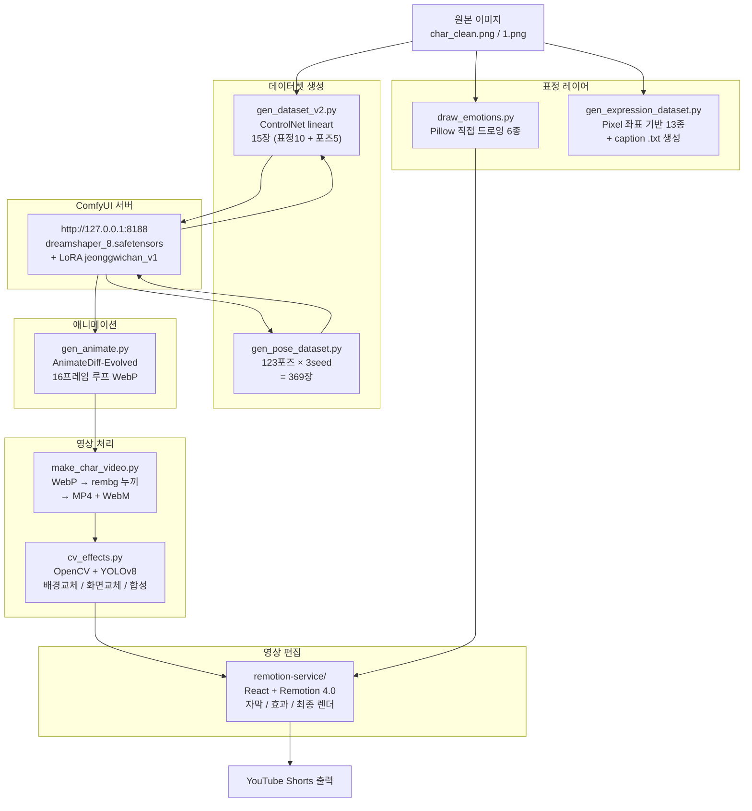

# gree 기술 스펙 문서

> 그리 캐릭터 기반 YouTube Shorts 자동 생성 파이프라인의 기술 명세.

---

## 1. 프로젝트 개요

**gree**는 오리지널 캐릭터 "그리"를 주인공으로 한 YouTube Shorts 콘텐츠를 반자동으로 생성하는 파이프라인이다. 원본 캐릭터 이미지를 시작점으로 삼아 표정 합성 → LoRA 학습 데이터셋 구성 → ComfyUI AnimateDiff 애니메이션 생성 → OpenCV/YOLO 배경 합성 → Remotion 영상 편집의 단계를 거쳐 최종 Shorts 영상을 출력한다.

**핵심 특징:**

- AI를 사용하지 않는 순수 코드 기반 표정 드로잉 (Pillow)
- ComfyUI HTTP API를 통한 배치 이미지 생성 자동화
- LoRA 특화 학습 데이터 파이프라인 (ControlNet lineart 기반)
- YOLOv8 객체 감지와 실시간 캐릭터 합성
- Remotion 4.0 React 기반 영상 조립 및 렌더링

---

## 2. 아키텍처 다이어그램



---

## 3. 모듈별 스펙

### 3.1 `src/expression/draw_emotions.py`

AI 없이 Pillow 드로잉만으로 표정을 합성한다. numpy로 어두운 픽셀 bbox를 자동 측정해 얼굴 위치를 파악하고, 실패 시 기본 fraction을 사용한다.

| 항목 | 내용 |
|------|------|
| 입력 | `C:\tool\pp\comfy_input\char_clean.png` (투명 PNG) |
| 출력 | `C:\tool\pp\anim_final\emotions\{emotion}.png` × 6종 |
| 표정 종류 | `neutral`, `happy`, `sad`, `angry`, `surprised`, `embarrassed` |
| 의존성 | `Pillow`, `numpy` |
| 특이사항 | 얼굴 bbox 자동 측정 → 지우기 → 재드로잉 순서로 처리. 몸/외곽선 보존, 알파 채널 유지 |

**표정별 구현:**

| 표정 | 눈 | 입 | 특수 효과 |
|------|----|----|-----------|
| neutral | 원형 | 타원형 | - |
| happy | arc (180~360) | arc 미소 | 볼터치 (BLUSH) |
| sad | 지우기 후 arc 눈썹 | arc 역방향 | - |
| angry | 대각선 눈썹 | 작은 arc | - |
| surprised | 원형 outline | 원형 outline | 수평 눈썹 |
| embarrassed | arc 반달 | arc 반달 | 짙은 볼터치 + 땀방울 |

---

### 3.1b 3D 표정 12종 (ComfyUI img2img + PIL 합성)

ComfyUI의 dreamshaper_8 + jeonggwichan_v6 LoRA로 그리 캐릭터를 3D 렌더 스타일로 생성하고, PIL로 눈물 등 특수 효과를 합성한다.

| 항목 | 내용 |
|------|------|
| 베이스 모델 | `dreamshaper_8.safetensors` |
| LoRA | `jeonggwichan_v6.safetensors` (strength 0.75~0.85) |
| Sampler | `dpmpp_2m / karras`, 30 steps, cfg 7.5~9.0 |
| 베이스 이미지 | `jeong_train_01_3d_front_base.png` (정면 팔벌림 포즈) |
| 출력 | `C:\tool\pp\anim_final\emotions_3d\{emotion}.png` × 12종 |
| 정규화 출력 | `C:\tool\pp\anim_final\emotions_3d_norm\{emotion}.png` (512×512, 캐릭터 높이 435px 통일) |
| 의존성 | `requests`, `Pillow`, `numpy`, `rembg`, `opencv-python` |

**12종 명세:**

| 표정 | 키 | 생성 방식 | 표현 |
|------|-----|----------|------|
| 무표정 | `neutral` | img2img (denoise 0.75) | 차분한 얼굴, 작은 미소, 팔 벌림 |
| 행복 | `happy` | img2img (denoise 0.75) | 큰 미소, 팔 크게 벌림, 분홍 볼 |
| 슬픔 | `sad` | img2img (denoise 0.75) | 처진 눈, 입꼬리 내림, 팔 처짐 |
| 화남 | `angry` | img2img (denoise 0.75) | 찡그린 눈, 주먹 쥠 |
| 놀람 | `surprised` | img2img (denoise 0.88, seed 7200) | 큰 눈, 입 벌림 O자 |
| 당황 | `embarrassed` | img2img (denoise 0.88, seed 12100) | 한 발 들고 뒤로 물러나는 리액션 |
| 울음 | `cry` | txt2img + PIL 합성 | 작은 슬픈 얼굴 + 하늘색 눈물 한 방울씩 |
| 설렘 | `excited` | img2img (denoise 0.87, seed 11100) | 분홍 볼 + 가로선 눈 (찡그림) |
| 피곤 | `tired` | img2img (denoise 0.87, seed 14200) | 반쯤 감긴 눈, 하품 |
| 공허 | `dead_inside` | img2img (denoise 0.85, seed 9300) | 텅 빈 눈, 완전 무표정 |
| 패닉 | `panic` | img2img (denoise 0.85, seed 6300) | 점프하며 입 벌림, 동적 포즈 |
| 분노 | `furious` | img2img (denoise 0.75) | 주먹 들어올림, 입 크게 벌림 |

**PIL 눈물 합성 (`울음` 전용):**

```
1. rembg로 배경 제거 후 알파 마스크 추출
2. 검정 픽셀 bbox로 양쪽 눈 좌표 자동 탐지
3. 하늘색 (R120 G195 B255) 눈물방울을 눈 아래 1개씩 배치
4. 타원 + 삼각형 합성 → GaussianBlur 0.8 적용
5. alpha composite로 원본에 합성
```

**정규화 (`normalize_3d_v2.py`):**

```
1. rembg로 캐릭터 외 배경 제거
2. 알파 마스크에서 tight bbox 추출 (4% 패딩)
3. 캐릭터 높이 = 435px (캔버스 85%)로 고정 리사이즈
4. 그라디언트 회색 배경 (238 중심 → 200 가장자리) 중앙 배치
```

**캐릭터 일관성 보장:**
- 모든 표정 동일한 베이스 이미지 (`gree_base.png`)에서 img2img
- denoise 0.75~0.88 범위에서 바디 형태 유지하며 표정/포즈만 변경
- 정규화 단계에서 모든 캐릭터를 동일 높이로 강제 통일

---

### 3.2 `src/expression/gen_expression_dataset.py`

LoRA 학습용 표정 데이터셋을 생성한다. 픽셀 분석으로 확정된 절대 좌표를 사용하며, 각 이미지와 쌍을 이루는 caption `.txt`를 자동 생성한다.

| 항목 | 내용 |
|------|------|
| 입력 | `C:\tool\pp\1.png` (원본 캐릭터, RGB) |
| 출력 | `C:\tool\pp\dataset\expressions\{name}.png` + `{name}.txt` × 13종 |
| 표정 종류 | `neutral`, `angry`, `furious`, `sad`, `cry`, `sob_wail`, `happy`, `shocked`, `tired`, `embarrassed`, `depressed`, `dead_inside`, `panic` |
| 의존성 | `Pillow` |
| 특이사항 | 코 영역(nx=378, ny=476)은 절대 수정하지 않음. 눈+눈썹 영역만 지우고 재드로잉 |

**고정 픽셀 좌표 (1.png 기준):**

- 왼눈 중심: (264, 398), 오른눈 중심: (501, 398)
- 코 중심: (378, 476) — 보호 영역
- 입 y: 520, 입 중심 x: 383

---

### 3.3 `src/animation/cv_effects.py`

OpenCV 기반 캐릭터 합성 도구. 3가지 모드를 CLI로 선택한다.

| 항목 | 내용 |
|------|------|
| 의존성 | `opencv-python`, `numpy`, `rembg` (선택), `ultralytics` (yolo_composite 모드) |
| 실행 | `python cv_effects.py --mode <모드> [옵션]` |

**모드 상세:**

| 모드 | 기능 | 핵심 인자 |
|------|------|-----------|
| `bg_replace` | 흰 배경 누끼 후 배경 이미지/영상으로 교체. `--rembg` 플래그로 AI 누끼 전환 가능 | `--char`, `--bg`, `--out` |
| `screen_overlay` | 캐릭터 손 앞 모니터 화면 교체. Perspective warp + 자동 밝은 직사각형 감지 | `--char`, `--screen`, `--out` |
| `yolo_composite` | YOLOv8으로 영상에서 `target_class` bbox 감지 → bbox 상단에 캐릭터 합성 | `--input`, `--char`, `--model`, `--out` |

**누끼 방법:**
- HSV threshold (빠름): 채도 낮음 + 명도 높음 기준으로 흰색 제거
- rembg AI (정밀): `--rembg` 플래그 사용 시 활성화, BGRA 반환

---

### 3.4 `src/animation/gen_animate.py`

ComfyUI HTTP API를 통해 AnimateDiff-Evolved 워크플로를 자동 실행하고 결과 파일을 로컬에 수집한다.

| 항목 | 내용 |
|------|------|
| 서버 | `http://127.0.0.1:8188` (ComfyUI 로컬) |
| 출력 | `C:\tool\pp\anim_test\jeong_anim_*.webp` (Animated WebP) + PNG 시퀀스 |
| 프레임 | 16프레임, 8fps, 512×512 |
| 의존성 | Python 표준 라이브러리만 사용 (`json`, `urllib`, `time`, `shutil`) |

**ComfyUI 노드 구성:**

| 노드 | class_type | 역할 |
|------|-----------|------|
| 1 | `CheckpointLoaderSimple` | dreamshaper_8.safetensors 로드 |
| 2 | `LoraLoader` | jeonggwichan_v1 LoRA 적용 (strength 0.8) |
| 3 | `ADE_AnimateDiffLoaderWithContext` | mm_sd_v15_v2.ckpt 모션 모듈 |
| 4 | `ADE_StandardStaticContextOptions` | context_length=16, overlap=4, pyramid fuse |
| 5~6 | `CLIPTextEncode` | positive / negative 프롬프트 |
| 7 | `EmptyLatentImage` | 512×512 배치=16 |
| 8 | `KSampler` | euler, 20스텝, cfg=7.0 |
| 9 | `VAEDecode` | 디코딩 |
| 10 | `SaveAnimatedWEBP` | 애니메이션 WebP 저장 |
| 11 | `SaveImage` | PNG 시퀀스 fallback 저장 |

---

### 3.5 `src/dataset/gen_dataset_v2.py`

ControlNet lineart 기반으로 캐릭터 실루엣을 고정하면서 표정/포즈를 변환한다. RMBG 노드로 배경을 흰색으로 통일한다.

| 항목 | 내용 |
|------|------|
| 서버 | `http://127.0.0.1:8188` (ComfyUI 로컬) |
| 입력 | `jeong_source.png` (ComfyUI/input/ 디렉토리) |
| 출력 | `C:\tool\pp\dataset\jeong_train_{name}.png` × 15장 |
| 생성 항목 | 표정 10장 (smile×2, angry×2, sad×2, surprised×2, neutral×2) + 포즈 5장 |
| 의존성 | Python 표준 라이브러리 |

**ComfyUI 노드 구성:**

| 노드 | class_type | 역할 |
|------|-----------|------|
| 1 | `CheckpointLoaderSimple` | dreamshaper_8.safetensors |
| 2~3 | `LoadImage` → `ImageScale` | 소스 이미지 512×512 리사이즈 |
| 4 | `LineArtPreprocessor` | lineart 전처리 (해상도 512) |
| 5 | `ControlNetLoader` | control_v11p_sd15_lineart.pth |
| 9 | `ControlNetApplyAdvanced` | strength 0.95(표정) / 0.75(포즈), end=0.9 |
| 10 | `KSampler` | dpmpp_2m + karras, 28스텝, cfg=7.0, denoise=1.0 |
| 12 | `RMBG` | INSPYRENET 배경 제거 → 흰 배경 |

---

### 3.6 `src/dataset/gen_pose_dataset.py`

LoRA 포즈 학습을 위한 대규모 데이터셋. 123개 포즈를 3개 시드로 반복 생성한다.

| 항목 | 내용 |
|------|------|
| 서버 | `http://127.0.0.1:8188` (ComfyUI 로컬) |
| 출력 | `C:\tool\pp\dataset\poses\{pose_name}_s{seed_idx}.png` + `.txt` (caption) |
| 총 이미지 수 | 123포즈 × 3시드 = **369장** |
| 시드 | [100, 200, 300] |
| 해상도 | 512×512 |
| 의존성 | Python 표준 라이브러리 |

**포즈 카테고리:**

| 카테고리 | 포즈 수 | 예시 |
|---------|---------|------|
| 이동 기본 | 10 | walk, run, sprint, tiptoe, skip |
| 점프/공중 | 6 | jump_up, crouch, leap, float, bounce |
| 파쿠르 | 6 | vault, wallrun, roll, climb, flip, slide |
| 춤 | 6 | wave, robot, spin, groove, jump, break |
| 먹기/일상 | 10 | eat, drink, sleep, carry, push, pull, lift |
| 감정 리액션 | 14 | cheer, scared, dizzy, tired, cry, laugh, shocked |
| 제스처 | 12 | wave, point, thumbs_up, shrug, bow, think |
| 넘어짐/충격 | 5 | fall_back, fall_forward, slip, dodge, knocked_out |
| 스포츠/격투 | 6 | kick, punch, throw, catch, defend, swing |
| 수영/자전거 | 4 | swim, bike, surf, ski |
| 앉기/눕기 | 4 | sit_ground, kneel, stretch_up, stretch_side |
| 작업/활동 | 5 | write, present, phone, cook, clean |
| 특수/개그 | 10 | peek, freeze, inflate, melt, rocket, superhero, victory |
| 컴퓨터/코딩 | 25 | typing, code_focus, eureka, error_rage, deploy_panic, pr_approved |

**LoRA 워크플로 구성:**

| 노드 | class_type | 설정 |
|------|-----------|------|
| 1 | `CheckpointLoaderSimple` | dreamshaper_8.safetensors |
| 2 | `LoraLoader` | jeonggwichan_v1, strength=1.0 |
| 6 | `KSampler` | dpmpp_2m + karras, 30스텝, cfg=8.0 |

---

### 3.7 `src/video/make_char_video.py`

AnimateDiff 출력물(Animated WebP)에서 배경을 제거하고 MP4/WebM으로 변환한다.

| 항목 | 내용 |
|------|------|
| 입력 | Animated WebP (ComfyUI 출력, scene1_coding_*.webp 등) |
| 출력 | `char_anim.mp4` (흰 배경 합성, libx264) + `char_anim.webm` (투명, VP9) |
| 출력 디렉토리 | `C:\tool\n8nproject\remotion-service\public\korini\` |
| FPS | 8 |
| 의존성 | `Pillow`, `numpy`, `rembg`, `imageio`, `imageio-ffmpeg` |

**처리 흐름:**
1. `Image.open()` + `seek()` 루프로 WebP 프레임 추출
2. `rembg.remove()` AI 누끼 처리 (프레임별)
3. MP4: `#111111` 배경 합성 후 libx264 인코딩
4. WebM: RGBA 그대로 libvpx-vp9 + yuva420p 인코딩 (투명도 보존)

---

### 3.8 `remotion-service/`

React + Remotion 4.0 기반 영상 편집 서비스. Express 서버로 렌더링 API를 제공한다.

| 항목 | 내용 |
|------|------|
| Node 버전 | 18+ |
| Remotion 버전 | 4.0.460 |
| React 버전 | 19.2.0 |
| TypeScript | 6.0.3 |
| 서버 진입점 | `server-local.js` (Express 5.x) |
| 렌더링 | `@remotion/renderer` + `@remotion/bundler` |

**컴포지션 목록 (`src/compositions/`):**

| 파일 | 설명 |
|------|------|
| `KoriniDailyShorts.tsx` | 그리 일상 Shorts |
| `AISideIncomeShorts.tsx` | AI 부수입 주제 Shorts |
| `AICompareShorts.tsx` | AI 비교 Shorts |
| `AIPromptCompare.tsx` | 프롬프트 비교 |
| `DevFutureShorts.tsx` | 개발자 미래 주제 |
| `VibeCodingSecurityShorts.tsx` | 바이브코딩 보안 |
| `VrewCodingCleanShorts.tsx` | Vrew 코딩 클린 |

**주요 패키지:**

| 패키지 | 용도 |
|--------|------|
| `@remotion/captions` | 자막 렌더링 |
| `@remotion/google-fonts` | 구글 폰트 |
| `@remotion/motion-blur` | 모션 블러 효과 |
| `@remotion/transitions` | 씬 전환 |
| `@remotion/lottie` | Lottie 애니메이션 |
| `@remotion/three` | Three.js 3D |
| `openai` | AI 자막/스크립트 생성 |
| `sharp` | 이미지 처리 |
| `pg` | PostgreSQL 연동 |

---

## 4. 환경 요구사항

### Python 환경

| 항목 | 요구사항 |
|------|---------|
| Python | 3.10+ |
| Pillow | >= 10.0.0 |
| numpy | >= 1.26.0 |
| opencv-python | >= 4.9.0 |
| rembg | >= 2.0.50 |
| ultralytics | >= 8.2.0 (YOLOv8) |
| imageio | >= 2.34.0 |
| imageio-ffmpeg | >= 0.5.0 |

```bash
pip install -r requirements.txt
```

### Node 환경

| 항목 | 요구사항 |
|------|---------|
| Node.js | 18+ |
| npm | 9+ |

```bash
cd remotion-service && npm install
```

### ComfyUI 환경

| 항목 | 요구사항 |
|------|---------|
| ComfyUI | 최신 버전 |
| 주소 | `http://127.0.0.1:8188` |
| 체크포인트 | `dreamshaper_8.safetensors` |
| LoRA | `jeonggwichan_v1-000008.safetensors` |
| 모션 모듈 | `mm_sd_v15_v2.ckpt` (AnimateDiff-Evolved) |
| ControlNet | `control_v11p_sd15_lineart.pth` |
| 커스텀 노드 | AnimateDiff-Evolved, ComfyUI-RMBG |

### 하드웨어

| 항목 | 권장사항 |
|------|---------|
| GPU | VRAM 8GB+ (ComfyUI 512×512 기준) |
| RAM | 16GB+ |
| 저장소 | SSD 권장 (데이터셋 369장 + 모델 파일) |

---

## 5. 데이터 흐름

```
원본 이미지 (char_clean.png / 1.png)
         │
         ├─── [표정 드로잉] draw_emotions.py
         │         └── emotions/{neutral,happy,sad,...}.png (6종)
         │
         ├─── [표정 데이터셋] gen_expression_dataset.py
         │         └── dataset/expressions/{name}.png + .txt (13종)
         │
         ├─── [ControlNet 데이터셋] gen_dataset_v2.py → ComfyUI
         │         └── dataset/jeong_train_{name}.png (15장)
         │
         └─── [포즈 데이터셋] gen_pose_dataset.py → ComfyUI
                   └── dataset/poses/{pose_name}_s{idx}.png + .txt (369장)

LoRA 학습 (kohya_ss / 별도 환경)
         │    입력: dataset/expressions/ + dataset/poses/
         │    출력: jeonggwichan_v1-000008.safetensors
         ▼

[AnimateDiff 생성] gen_animate.py → ComfyUI
         │    모델: dreamshaper_8 + LoRA + mm_sd_v15_v2
         └── anim_test/jeong_anim_*.webp (16프레임 Animated WebP)

[배경 제거 + 영상 변환] make_char_video.py
         │    입력: jeong_anim_*.webp
         └── remotion-service/public/korini/char_anim.mp4 + .webm

[OpenCV + YOLO 합성] cv_effects.py  ─── 선택적 후처리
         │    입력: char_anim.mp4 + 배경/화면
         └── output.mp4 (합성 완료)

[Remotion 영상 편집] remotion-service/
         │    입력: char_anim.mp4 + 자막 + 효과
         └── 최종 YouTube Shorts MP4
```

---

## 6. 외부 의존성

### 모델 파일

| 파일명 | 위치 | 용도 | 비고 |
|--------|------|------|------|
| `yolov8n.pt` | 레포 루트 (`C:\youtube\`) | YOLOv8 nano 객체 감지 | ultralytics 자동 다운로드 가능 |
| `dreamshaper_8.safetensors` | ComfyUI/models/checkpoints/ | 이미지 생성 베이스 모델 | Civitai 배포 |
| `jeonggwichan_v1-000008.safetensors` | ComfyUI/models/loras/ | 그리 캐릭터 LoRA | kohya_ss 자체 학습 |
| `mm_sd_v15_v2.ckpt` | ComfyUI/models/animatediff_models/ | AnimateDiff 모션 모듈 | AnimateDiff-Evolved 전용 |
| `control_v11p_sd15_lineart.pth` | ComfyUI/models/controlnet/ | ControlNet lineart | gen_dataset_v2.py 전용 |

### 주요 외부 서비스

| 서비스 | 용도 | 설정 위치 |
|--------|------|-----------|
| ComfyUI 로컬 서버 | 이미지/애니메이션 생성 | `SERVER = "http://127.0.0.1:8188"` |
| OpenAI API | Remotion 자막/스크립트 생성 | `remotion-service/.env` |
| PostgreSQL | Remotion 서비스 데이터 저장 | `remotion-service/.env` |

### Git 제외 항목 (.gitignore 권장)

- `yolov8n.pt` — 바이너리 모델 파일
- `*.safetensors`, `*.ckpt`, `*.pth` — 대용량 모델 파일
- `dataset/` — 생성된 학습 데이터셋
- `remotion-service/.env` — API 키 포함
- `remotion-service/node_modules/`

---

## 7. 빠른 시작

```bash
# 1. Python 의존성 설치
pip install -r requirements.txt

# 2. 표정 합성 (char_clean.png 필요)
python src/expression/draw_emotions.py

# 3. 표정 LoRA 데이터셋 생성 (1.png 필요)
python src/expression/gen_expression_dataset.py

# 4. ControlNet 기반 데이터셋 생성 (ComfyUI 서버 필요)
python src/dataset/gen_dataset_v2.py

# 5. 포즈 데이터셋 대량 생성 (ComfyUI 서버 필요, 약 수 시간)
python src/dataset/gen_pose_dataset.py

# 6. AnimateDiff 루프 애니메이션 생성 (ComfyUI 서버 필요)
python src/animation/gen_animate.py

# 7. WebP → MP4/WebM 변환 (rembg 누끼)
python src/video/make_char_video.py

# 8. YOLO 배경 합성
python src/animation/cv_effects.py --mode yolo_composite \
  --input video.mp4 --char char_clean.png --model yolov8n.pt --out out.mp4

# 9. Remotion 영상 편집
cd remotion-service && npm install && npm start
```
