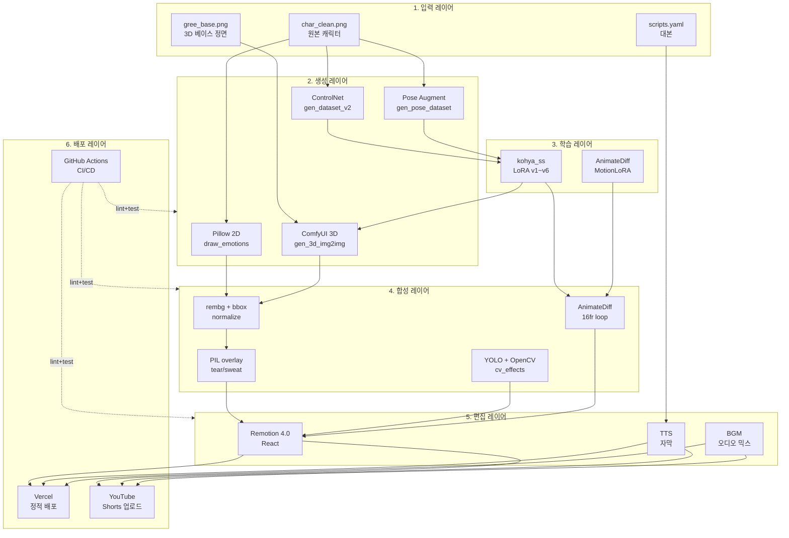

# 시스템 아키텍처

gree 파이프라인의 전체 시스템 구성 및 데이터 흐름 명세.

---

## 레이어 구조



---

## 데이터 흐름

### 학습 데이터 생성
```
원본 1장 → augment 154장 → caption .txt 154개 → kohya_ss → LoRA v6
```

### 3D 표정 12종 생성
```
gree_base.png → ComfyUI /upload → img2img(denoise 0.75~0.88)
  → PreviewImage → /view?type=temp → 다운로드 → normalize → PIL overlay
  → emotions_3d_norm/{emotion}.png × 12
```

### 영상 합성
```
char.webp → rembg → char.mp4 (투명 webm)
       ↓
video.mp4 + char.mp4 → YOLO bbox + OpenCV composite → composite.mp4
       ↓
composite.mp4 + scripts.yaml → Remotion → final.mp4 → YouTube
```

---

## 컴포넌트 간 인터페이스

| 컴포넌트 A | 컴포넌트 B | 인터페이스 |
|-----------|-----------|-----------|
| `gen_3d_img2img.py` | ComfyUI | HTTP /prompt + /history + /view |
| `normalize_3d_v2.py` | rembg | Python API (remove function) |
| `cry_tear_overlay.py` | PIL | ImageDraw + alpha_composite |
| `cv_effects.py` | YOLOv8 | ultralytics.YOLO Python API |
| `remotion-service/` | Node 18 | React component → CLI render |
| GitHub Actions | Python/Node | runner + secrets |

---

## 디렉토리 책임 분리

| 경로 | 책임 | git 관리 |
|------|------|---------|
| `C:\tool\pp\` | 표정/데이터셋 생성 스크립트 | ✓ |
| `C:\tool\pp\ComfyUI\` | 추론 엔진 (외부) | ✗ |
| `C:\tool\kohya_ss\` | LoRA 학습 도구 (외부) | ✗ |
| `D:\lora_train\` | 학습 데이터 + 모델 (대용량) | ✗ |
| `C:\youtube\` | 메인 레포 (코드/문서) | ✓ |
| `C:\youtube\remotion-service\` | 영상 편집 서비스 | ✓ |
