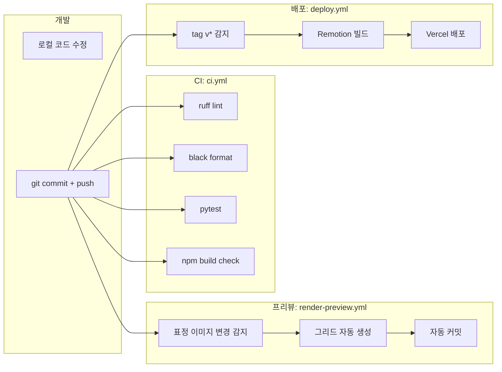

# CI/CD 및 배포 가이드

GitHub Actions 기반 자동화 파이프라인 운영 명세.

---

## 워크플로우 전체 흐름



---

## 워크플로우별 명세

### `ci.yml` — 기본 검증
| 항목 | 내용 |
|------|------|
| 트리거 | `push` to main, `pull_request` |
| 러너 | ubuntu-latest |
| Python | 3.10, pip cache |
| Node | 18, npm cache |
| 실패 조건 | pytest 실패 시 |
| 소요 시간 | ~3분 |

### `render-preview.yml` — 표정 그리드 자동 갱신
| 항목 | 내용 |
|------|------|
| 트리거 | `assets/emotions_3d/**` 변경 |
| 작업 | `scripts/build_preview_grid.py` 실행 → 그리드 PNG 생성 → 자동 커밋 |
| 권한 | `contents: write` |
| 봇 | `github-actions[bot]` |

### `deploy.yml` — Remotion 배포
| 항목 | 내용 |
|------|------|
| 트리거 | tag `v*` push |
| 빌드 | `npm run build` (Remotion 정적 빌드) |
| 배포 | Vercel `--prod` |

---

## 시크릿 설정

GitHub repository → Settings → Secrets and variables → Actions

| 이름 | 용도 | 발급 |
|------|------|------|
| `COMFY_API_URL` | 원격 ComfyUI 서버 URL | 자체 서버 |
| `VERCEL_TOKEN` | Vercel 배포 토큰 | vercel.com/account/tokens |
| `YT_OAUTH_REFRESH` | YouTube 업로드 토큰 | Google Cloud Console |
| `OPENAI_API_KEY` | TTS / 스크립트 생성 (선택) | platform.openai.com |

---

## 로컬에서 워크플로우 테스트

```bash
# act (GitHub Actions 로컬 러너) 설치
brew install act        # macOS
choco install act-cli   # Windows

# CI 워크플로우 로컬 실행
act -j python

# 시크릿 포함
act -j deploy --secret-file .secrets
```

---

## 배포 절차

### 패치 릴리즈 (v1.0.1)
```bash
git tag v1.0.1
git push origin v1.0.1
# → deploy.yml 자동 트리거 → Vercel 배포
```

### 표정 그리드 수동 갱신
```bash
gh workflow run render-preview.yml
```

### 강제 재빌드
```bash
gh workflow run deploy.yml --ref main
```

---

## 모니터링

| 항목 | 위치 |
|------|------|
| 빌드 상태 | https://github.com/rhlfur2055-prog/gree/actions |
| 배포 URL | Vercel 대시보드 |
| YouTube 업로드 로그 | Cloud Logging (yt-uploader 서비스) |
