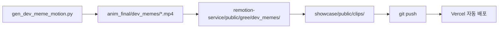

# gree showcase — Vercel 정적 사이트

말없이 보는 개발자 밈 갤러리. **그리 캐릭터 + 12 모션 클립 + 한/영/일 자막 토글.**

## 구조

```
showcase/
├── public/
│   ├── index.html         # SPA (Vanilla JS, 외부 빌드 0)
│   ├── catalog.json       # 12 시나리오 메타
│   ├── clips/*.mp4        # AnimateDiff 모션 클립 12개
│   └── emotions/*.png     # ComfyUI 표정 12종
└── vercel.json            # Vercel 배포 설정 (CDN 캐시 + 보안 헤더)
```

빌드 단계 없음 — `public/`을 그대로 정적 서빙.

---

## Vercel 배포 (5분)

### 1. Vercel 계정 + 프로젝트 생성

1. https://vercel.com 가입 (GitHub 로그인 권장)
2. Dashboard → **New Project** → Import `rhlfur2055-prog/gree`
3. **Root Directory** = `showcase` 지정
4. Framework Preset = **Other**
5. Output Directory = `public`
6. Deploy 클릭

→ `https://gree-{hash}.vercel.app` 자동 생성

### 2. 커스텀 도메인 (선택)

Vercel 프로젝트 → Settings → Domains → `gree.dev` 등 추가

### 3. GitHub Actions 자동 배포 (선택)

`.github/workflows/deploy.yml` 작동시키려면:

1. Vercel 토큰 발급: https://vercel.com/account/tokens → **Create Token**
2. GitHub repo → Settings → Secrets and variables → Actions → **New repository secret**
   - `VERCEL_TOKEN` = 발급받은 토큰
   - `VERCEL_ORG_ID` = Vercel 프로젝트 Settings에서 확인
   - `VERCEL_PROJECT_ID` = Vercel 프로젝트 Settings에서 확인
3. tag push로 트리거:
   ```bash
   git tag v1.0.0
   git push origin v1.0.0
   ```

---

## 로컬 미리보기

빌드 없음 → 그냥 정적 서빙:

```bash
cd showcase/public
python -m http.server 8080
# → http://localhost:8080
```

또는 Node:
```bash
npx serve public
```

---

## 컨셉

- **말없이 (no narration)** = 언어 장벽 없음 = 한/영/일 시청자 모두 OK
- **캐릭터 + 텍스트 라벨** = TikTok/Reels/Shorts 알고리즘 친화적
- **2초 루프 × 12** = 어디서든 thumbnail로 viral 가능

> 핵심: 캐릭터 기반 컨텐츠는 말없이 해야 범용성이 살아난다.

---

## 업데이트 흐름



새 시나리오 추가 시:
1. `gen_dev_meme_motion.py`의 `SCENES`에 항목 추가
2. `python gen_dev_meme_motion.py` 실행 (45초/클립)
3. `cp ../anim_final/dev_memes/*.mp4 showcase/public/clips/`
4. `git push` → Vercel 자동 재배포
